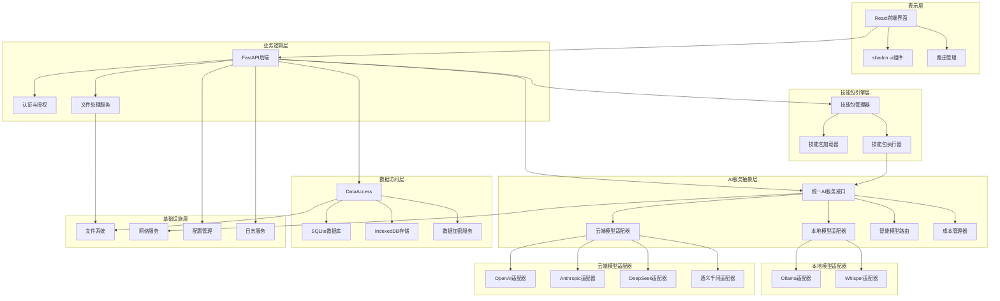

# 职场技能包大师 - 系统总体架构图

## 分层架构设计

## 架构说明

### 1. 表示层
- **React前端界面**：使用React 18 + TypeScript构建现代化UI
- **shadcn ui组件**：使用预设组件库，保证界面一致性
- **路由管理**：处理前端页面导航

### 2. 业务逻辑层
- **FastAPI后端**：提供RESTful API服务
- **认证与授权**：管理用户权限和API密钥安全
- **文件处理服务**：处理各种格式文件的上传和解析

### 3. 技能包引擎层
- **技能包管理器**：管理技能包的加载、卸载和配置
- **技能包加载器**：从文件系统加载Markdown格式的技能包
- **技能包执行器**：执行技能包的逻辑，调用AI服务

### 4. AI服务抽象层（核心）
- **统一AI服务接口**：提供标准化的AI调用接口
- **本地模型适配器**：适配Ollama和Whisper等本地模型
- **云端模型适配器**：适配OpenAI、Anthropic、DeepSeek、通义千问等云端API
- **智能模型路由**：根据任务类型和配置自动选择最优模型
- **成本管理器**：统计token消耗和成本，管理预算

### 5. 数据访问层
- **SQLite数据库**：存储系统配置、技能包信息等
- **IndexedDB存储**：浏览器本地存储，存储用户配置和历史记录
- **数据加密服务**：使用AES-256加密敏感数据

### 6. 基础设施层
- **文件系统**：处理文件读写操作
- **网络服务**：处理网络请求和API调用
- **配置管理**：管理系统配置和环境变量
- **日志服务**：记录系统运行日志

## 核心数据流

1. **用户请求流**：用户在前端选择技能包 → 输入参数 → 前端发送请求到后端 → 后端调用技能包执行器 → 技能包执行器调用AI服务 → AI服务选择模型执行 → 返回结果到前端

2. **模型调用流**：技能包执行器 → 统一AI服务接口 → 智能模型路由 → 选择模型适配器 → 调用具体模型 → 处理响应 → 返回结果

3. **数据存储流**：系统配置 → 数据访问层 → 加密服务 → SQLite/IndexedDB → 持久化存储

## 关键特性

- **模块化设计**：各层职责清晰，易于扩展
- **多模型支持**：统一接口支持本地和云端多种模型
- **智能路由**：根据任务类型和配置自动选择最优模型
- **成本控制**：实时统计和管理AI调用成本
- **数据安全**：敏感数据加密存储，本地优先处理
- **离线可用**：支持完全离线模式，确保核心功能可用
