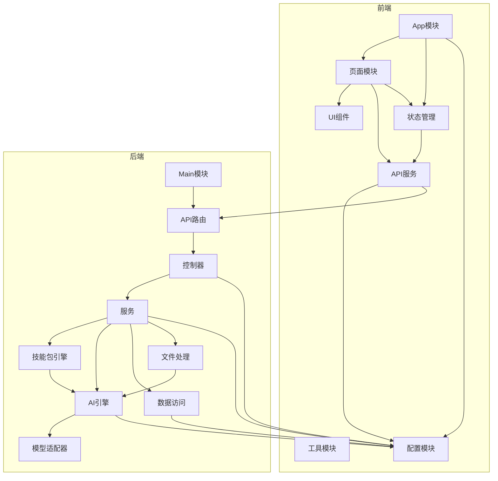

# 职场技能包大师 - 模块划分

## 前端模块

### 1. 主应用模块（App）
- **模块名称**：App
- **模块职责**：应用入口，全局状态管理
- **主要功能**：
  - 应用初始化
  - 全局状态管理（Redux/Context API）
  - 路由配置
  - 主题管理
- **依赖关系**：
  - 依赖：所有前端模块
  - 被依赖：无

### 2. 界面组件模块（UI）
- **模块名称**：UI Components
- **模块职责**：提供通用UI组件
- **主要功能**：
  - 基础组件（按钮、输入框、卡片等）
  - 布局组件（网格、容器等）
  - 表单组件（表单、验证等）
  - 模态框、提示框等
- **依赖关系**：
  - 依赖：shadcn/ui、Tailwind CSS
  - 被依赖：所有页面模块

### 3. 页面模块（Pages）
- **模块名称**：Pages
- **模块职责**：应用的主要页面
- **主要功能**：
  - 首页（技能包选择）
  - 技能包详情页
  - 结果展示页
  - 设置页面
  - 历史记录页面
- **依赖关系**：
  - 依赖：UI组件模块、API服务模块
  - 被依赖：主应用模块

### 4. API服务模块（API）
- **模块名称**：API Services
- **模块职责**：处理与后端的通信
- **主要功能**：
  - 技能包相关API
  - AI服务API
  - 文件上传API
  - 配置管理API
- **依赖关系**：
  - 依赖：无
  - 被依赖：页面模块、状态管理模块

### 5. 状态管理模块（State）
- **模块名称**：State Management
- **模块职责**：管理应用状态
- **主要功能**：
  - 技能包状态
  - 用户配置状态
  - 历史记录状态
  - 加载状态管理
- **依赖关系**：
  - 依赖：API服务模块
  - 被依赖：页面模块

### 6. 工具模块（Utils）
- **模块名称**：Utils
- **模块职责**：提供通用工具函数
- **主要功能**：
  - 日期时间处理
  - 字符串处理
  - 文件处理
  - 错误处理
- **依赖关系**：
  - 依赖：无
  - 被依赖：所有前端模块

### 7. 配置模块（Config）
- **模块名称**：Config
- **模块职责**：管理应用配置
- **主要功能**：
  - 环境变量管理
  - 应用配置
  - API配置
- **依赖关系**：
  - 依赖：无
  - 被依赖：API服务模块、主应用模块

---

## 后端模块

### 1. 主应用模块（Main）
- **模块名称**：Main
- **模块职责**：FastAPI应用入口
- **主要功能**：
  - 应用初始化
  - 路由注册
  - 中间件配置
  - 异常处理
- **依赖关系**：
  - 依赖：所有后端模块
  - 被依赖：无

### 2. API路由模块（Routes）
- **模块名称**：Routes
- **模块职责**：定义API路由
- **主要功能**：
  - 技能包API
  - AI服务API
  - 文件处理API
  - 配置管理API
- **依赖关系**：
  - 依赖：控制器模块
  - 被依赖：主应用模块

### 3. 控制器模块（Controllers）
- **模块名称**：Controllers
- **模块职责**：处理API请求
- **主要功能**：
  - 技能包控制器
  - AI服务控制器
  - 文件处理控制器
  - 配置控制器
- **依赖关系**：
  - 依赖：服务模块
  - 被依赖：API路由模块

### 4. 服务模块（Services）
- **模块名称**：Services
- **模块职责**：业务逻辑处理
- **主要功能**：
  - 技能包服务
  - AI服务
  - 文件处理服务
  - 配置服务
- **依赖关系**：
  - 依赖：AI引擎模块、数据访问模块
  - 被依赖：控制器模块

### 5. 技能包引擎模块（SkillEngine）
- **模块名称**：SkillEngine
- **模块职责**：技能包管理和执行
- **主要功能**：
  - 技能包加载
  - 技能包解析
  - 技能包执行
  - 技能包配置管理
- **依赖关系**：
  - 依赖：AI服务模块
  - 被依赖：服务模块

### 6. AI引擎模块（AIEngine）
- **模块名称**：AIEngine
- **模块职责**：AI服务抽象和管理
- **主要功能**：
  - 统一AI服务接口
  - 模型适配器管理
  - 智能模型路由
  - 成本管理
- **依赖关系**：
  - 依赖：模型适配器模块
  - 被依赖：技能包引擎模块、服务模块

### 7. 模型适配器模块（ModelAdapters）
- **模块名称**：ModelAdapters
- **模块职责**：适配不同的AI模型
- **主要功能**：
  - Ollama适配器
  - Whisper适配器
  - OpenAI适配器
  - 其他云端模型适配器
- **依赖关系**：
  - 依赖：无
  - 被依赖：AI引擎模块

### 8. 数据访问模块（DataAccess）
- **模块名称**：DataAccess
- **模块职责**：数据存储和访问
- **主要功能**：
  - SQLite数据库操作
  - IndexedDB操作
  - 数据加密
  - 配置持久化
- **依赖关系**：
  - 依赖：无
  - 被依赖：服务模块

### 9. 文件处理模块（FileProcessing）
- **模块名称**：FileProcessing
- **模块职责**：处理各种文件格式
- **主要功能**：
  - 文档解析（Word、PDF、PPT）
  - 数据处理（Excel、CSV）
  - 音频处理（语音转文字）
  - 文件格式转换
- **依赖关系**：
  - 依赖：AI引擎模块（语音处理）
  - 被依赖：服务模块

### 10. 工具模块（Utils）
- **模块名称**：Utils
- **模块职责**：提供通用工具函数
- **主要功能**：
  - 文本处理
  - 加密解密
  - 日志记录
  - 错误处理
- **依赖关系**：
  - 依赖：无
  - 被依赖：所有后端模块

### 11. 配置模块（Config）
- **模块名称**：Config
- **模块职责**：管理系统配置
- **主要功能**：
  - 环境变量管理
  - 模型配置
  - API密钥管理
  - 系统设置
- **依赖关系**：
  - 依赖：无
  - 被依赖：所有后端模块

---

## 模块依赖关系图

## 模块设计原则

1. **高内聚低耦合**：每个模块职责单一，与其他模块的依赖最小化
2. **模块化设计**：便于单独开发、测试和维护
3. **接口标准化**：定义清晰的模块间接口
4. **可扩展性**：支持新功能和新模型的添加
5. **可测试性**：便于单元测试和集成测试

## 关键模块说明

1. **技能包引擎**：核心模块，负责技能包的管理和执行
2. **AI引擎**：核心模块，提供统一的AI服务接口和智能路由
3. **模型适配器**：关键模块，实现不同模型的适配
4. **文件处理**：重要模块，支持多种文件格式的处理
5. **数据访问**：基础模块，处理数据的存储和加密
