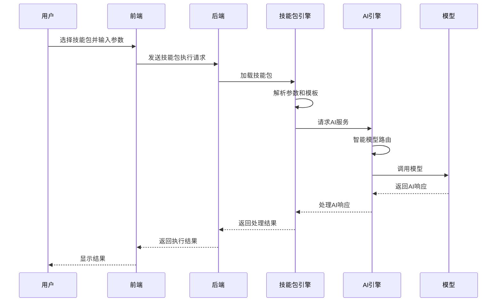

# 职场技能包大师 - 技能包系统设计

## 1. Markdown技能包格式规范

### 1.1 基本结构
技能包使用标准Markdown格式，包含YAML front matter和Markdown正文两部分。

```markdown
---
id: email-writer
name: 邮件写作助手
version: 1.0.0
author: 系统
category: general
description: 智能邮件写作助手，帮助你快速生成专业邮件
createdAt: 2024-01-01T00:00:00Z
updatedAt: 2024-01-01T00:00:00Z
tags:
  - 邮件
  - 写作
  - 商务
modelRequirements:
  - type: local
    modelType: text
    minTokens: 1000
    recommendedModels:
      - llama3:8b
      - gemma:7b
    fallbackEnabled: true
  - type: cloud
    modelType: text
    minTokens: 1000
    recommendedModels:
      - gpt-4
      - gpt-3.5-turbo
    fallbackEnabled: true
parameters:
  - id: recipient
    name: recipient
    type: text
    label: 收件人
    description: 邮件收件人
    required: true
    placeholder: 请输入收件人姓名或邮箱
  - id: subject
    name: subject
    type: text
    label: 邮件主题
    description: 邮件的主题
    required: true
    placeholder: 请输入邮件主题
  - id: content
    name: content
    type: textarea
    label: 邮件内容要点
    description: 请简要描述邮件的主要内容
    required: true
    placeholder: 请输入邮件内容要点，多个要点请换行
  - id: tone
    name: tone
    type: select
    label: 语气风格
    description: 选择邮件的语气风格
    required: true
    default: professional
    options:
      - professional: 专业正式
      - friendly: 友好亲切
      - urgent: 紧急重要
      - casual: 轻松随意
---

## 邮件写作助手

### 功能描述
智能生成符合职场规范的专业邮件，支持多种语气风格。

### 输入参数
- **收件人**：邮件的接收者
- **邮件主题**：邮件的主题行
- **邮件内容要点**：需要包含的主要内容
- **语气风格**：邮件的语气和风格

### 提示词模板

你是一位专业的邮件写作助手，请根据以下信息生成一封格式规范、语气专业的邮件：

**收件人**：{{recipient}}
**主题**：{{subject}}
**内容要点**：
{{content}}
**语气风格**：{{tone}}

请按照以下格式生成邮件：
1. 开头问候语
2. 简明扼要的正文内容
3. 适当的结束语
4. 发件人签名

邮件应该：
- 语言流畅，逻辑清晰
- 符合职场邮件规范
- 语气与选择的风格一致
- 内容完整，涵盖所有要点

### 输出格式

```
To: {{recipient}}
Subject: {{subject}}

[邮件正文]

[发件人签名]
```

### 示例

**输入**：
- 收件人：张三
- 主题：关于项目延期的通知
- 内容要点：
  - 项目进度回顾
  - 延期原因说明
  - 新的时间安排
  - 后续工作计划
- 语气风格：专业正式

**输出**：
```
To: 张三
Subject: 关于项目延期的通知

尊敬的张三：

您好！

关于我们正在进行的项目，我需要向您通知一个重要事项。经过团队的评估，我们遗憾地发现项目需要进行延期调整。

**项目进度回顾**：
截至目前，我们已完成了项目的核心功能开发，但在测试阶段发现了一些需要优化的问题。

**延期原因**：
主要是由于第三方API的集成遇到了一些技术挑战，需要额外的时间进行调试和优化。

**新的时间安排**：
项目预计将延期2周，新的交付日期为2024年1月30日。

**后续工作计划**：
我们已制定了详细的工作计划，确保在新的时间内高质量完成项目。团队将每周向您汇报进展情况。

如有任何疑问，请随时与我联系。

此致
敬礼

[您的姓名]
[您的职位]
```

## 2. 技能包加载机制

### 2.1 加载流程

1. **扫描技能包目录**：系统启动时扫描指定目录中的Markdown文件
2. **解析YAML Front Matter**：提取技能包元数据和参数定义
3. **验证技能包格式**：检查必填字段和格式是否正确
4. **加载技能包**：将技能包信息加载到内存中
5. **缓存技能包**：为提高性能，技能包被缓存到内存中

### 2.2 目录结构

```
skill-packages/
├── general/              # 通用技能包
│   ├── email-writer.md   # 邮件写作助手
│   ├── meeting-notes.md  # 会议纪要助手
│   ├── weekly-report.md  # 周报生成助手
│   ├── ppt-outline.md    # PPT大纲助手
│   ├── data-analysis.md  # 数据分析助手
│   └── task-breakdown.md # 任务拆解助手
└── professional/         # 专业技能包
    ├── resume-optimizer.md  # 简历优化助手
    └── interview-prep.md    # 面试准备助手
```

### 2.3 技能包验证

系统会对技能包进行以下验证：
- 必须包含所有必填字段（id, name, version, author, category, description）
- 参数定义必须符合格式要求
- 模型需求定义必须完整
- 提示词模板必须包含所有参数变量
- Markdown格式必须正确

## 3. 技能包调用流程

### 3.1 调用流程图



### 3.2 详细流程

1. **用户选择技能包**：用户在前端界面选择需要使用的技能包
2. **输入参数**：用户根据技能包的参数定义输入相应的信息
3. **发送请求**：前端将技能包ID和参数发送到后端
4. **技能包加载**：后端加载对应的技能包定义
5. **模板渲染**：使用用户输入的参数渲染提示词模板
6. **模型选择**：AI引擎根据任务类型和配置选择合适的模型
7. **AI调用**：调用选定的模型执行任务
8. **结果处理**：处理AI返回的响应，进行格式转换和后处理
9. **返回结果**：将处理后的结果返回给前端
10. **显示结果**：前端显示执行结果给用户

## 4. 自定义技能包创建指南

### 4.1 准备工作

1. **了解技能包格式**：熟悉Markdown技能包的格式规范
2. **确定技能包功能**：明确技能包的用途和目标
3. **设计参数结构**：确定需要哪些输入参数
4. **编写提示词模板**：创建有效的AI提示词

### 4.2 创建步骤

1. **创建Markdown文件**：在技能包目录中创建一个新的Markdown文件
2. **添加YAML Front Matter**：填写技能包的基本信息和参数定义
3. **编写技能包文档**：在Markdown正文中添加技能包的说明文档
4. **编写提示词模板**：创建包含参数变量的提示词模板
5. **添加输出格式说明**：指定期望的输出格式
6. **添加示例**：提供输入输出示例
7. **测试技能包**：使用系统测试技能包的功能

### 4.3 最佳实践

- **参数设计**：
  - 只包含必要的参数
  - 提供合理的默认值
  - 使用清晰的标签和描述
  - 选择合适的参数类型

- **提示词模板**：
  - 清晰地描述任务要求
  - 提供具体的格式指导
  - 包含所有必要的参数变量
  - 使用专业、明确的语言

- **模型需求**：
  - 合理设置token要求
  - 推荐合适的模型
  - 启用fallback策略

### 4.4 示例：创建一个简单的技能包

#### 会议纪要助手技能包

```markdown
---
id: meeting-notes
name: 会议纪要助手
version: 1.0.0
author: 系统
category: general
description: 智能会议纪要生成助手，帮助你快速整理会议内容
createdAt: 2024-01-01T00:00:00Z
updatedAt: 2024-01-01T00:00:00Z
tags:
  - 会议
  - 纪要
  - 整理
modelRequirements:
  - type: local
    modelType: text
    minTokens: 1500
    recommendedModels:
      - llama3:8b
    fallbackEnabled: true
parameters:
  - id: meeting_topic
    name: meeting_topic
    type: text
    label: 会议主题
    description: 会议的主题
    required: true
    placeholder: 请输入会议主题
  - id: participants
    name: participants
    type: text
    label: 参会人员
    description: 参会人员列表
    required: true
    placeholder: 请输入参会人员，用逗号分隔
  - id: meeting_content
    name: meeting_content
    type: textarea
    label: 会议内容
    description: 会议的主要内容
    required: true
    placeholder: 请输入会议内容要点，多个要点请换行
  - id: meeting_date
    name: meeting_date
    type: text
    label: 会议日期
    description: 会议举行的日期
    required: true
    placeholder: 请输入会议日期，如2024-01-01
---

## 会议纪要助手

### 功能描述
智能生成结构化的会议纪要，帮助你快速整理会议内容。

### 输入参数
- **会议主题**：会议的主题
- **参会人员**：参加会议的人员
- **会议内容**：会议讨论的主要内容
- **会议日期**：会议举行的日期

### 提示词模板

你是一位专业的会议纪要助手，请根据以下信息生成一份结构化的会议纪要：

**会议主题**：{{meeting_topic}}
**参会人员**：{{participants}}
**会议日期**：{{meeting_date}}
**会议内容**：
{{meeting_content}}

请按照以下格式生成会议纪要：
1. 会议基本信息
2. 参会人员
3. 会议议程
4. 讨论要点
5. 决议事项
6. 后续行动
7. 下次会议安排

会议纪要应该：
- 结构清晰，层次分明
- 内容完整，涵盖所有要点
- 语言简洁，重点突出
- 格式规范，便于阅读

### 输出格式

```
# 会议纪要

## 基本信息
- **主题**：{{meeting_topic}}
- **日期**：{{meeting_date}}
- **地点**：[地点]
- **记录人**：[记录人]

## 参会人员
{{participants}}

## 会议议程
1. [议程项1]
2. [议程项2]
3. [议程项3]

## 讨论要点
- **要点1**：[详细内容]
- **要点2**：[详细内容]
- **要点3**：[详细内容]

## 决议事项
1. [决议1]
2. [决议2]
3. [决议3]

## 后续行动
| 行动项 | 负责人 | 截止日期 |
|--------|--------|----------|
| [行动项1] | [负责人] | [截止日期] |
| [行动项2] | [负责人] | [截止日期] |

## 下次会议安排
- **时间**：[时间]
- **地点**：[地点]
- **主题**：[主题]
```

### 示例

**输入**：
- 会议主题：项目进度评审
- 参会人员：张三、李四、王五、赵六
- 会议日期：2024-01-15
- 会议内容：
  - 项目当前进度回顾
  - 遇到的技术挑战
  - 资源分配问题
  - 下一阶段计划

**输出**：
```
# 会议纪要

## 基本信息
- **主题**：项目进度评审
- **日期**：2024-01-15
- **地点**：会议室A
- **记录人**：系统

## 参会人员
张三、李四、王五、赵六

## 会议议程
1. 项目当前进度回顾
2. 技术挑战讨论
3. 资源分配问题
4. 下一阶段计划

## 讨论要点
- **项目进度**：目前完成了总体进度的60%，核心功能已实现
- **技术挑战**：第三方API集成遇到了兼容性问题，需要额外时间解决
- **资源分配**：前端开发人员不足，影响了UI开发进度
- **下一阶段**：需要重点关注测试和优化工作

## 决议事项
1. 技术团队将在3天内解决API集成问题
2. 从其他项目临时借调一名前端开发人员
3. 调整项目计划，将测试阶段延长1周

## 后续行动
| 行动项 | 负责人 | 截止日期 |
|--------|--------|----------|
| API集成问题解决 | 李四 | 2024-01-18 |
| 前端资源协调 | 张三 | 2024-01-16 |
| 测试计划制定 | 王五 | 2024-01-17 |

## 下次会议安排
- **时间**：2024-01-22 10:00
- **地点**：会议室A
- **主题**：项目进度跟进
```
