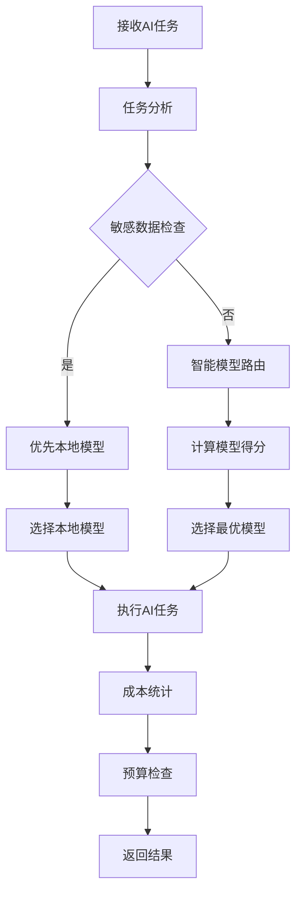

# 职场技能包大师 - 多模型AI引擎设计

## 1. 统一AI服务接口定义

### 1.1 核心接口

```typescript
interface AIService {
  // 文本生成
  generateText(prompt: string, options?: GenerateOptions): Promise<GenerateResult>;
  
  // 语音转文字
  transcribeAudio(audioPath: string, options?: TranscribeOptions): Promise<TranscribeResult>;
  
  // 模型信息
  getModels(): Promise<Model[]>;
  
  // 模型状态检查
  checkModelStatus(modelId: string): Promise<ModelStatus>;
  
  // 智能路由
  routeTask(task: AITask): Promise<Model>;
  
  // 成本管理
  getCostStatistics(period: 'day' | 'week' | 'month'): Promise<CostStatistics>;
  
  // 预算管理
  checkBudget(): Promise<BudgetStatus>;
}
```

### 1.2 数据结构

#### 生成选项
```typescript
interface GenerateOptions {
  modelId?: string;          // 模型ID
  temperature?: number;      // 温度参数
  maxTokens?: number;        // 最大token数
  topP?: number;            // 核采样参数
  frequencyPenalty?: number; // 频率惩罚
  presencePenalty?: number;  // 存在惩罚
  timeout?: number;          // 超时时间（毫秒）
  stop?: string[];           // 停止词
  stream?: boolean;          // 是否流式输出
}
```

#### 生成结果
```typescript
interface GenerateResult {
  text: string;             // 生成的文本
  tokenUsage: TokenUsage;    // token使用情况
  cost: number;             // 消耗成本
  duration: number;         // 执行时间（毫秒）
  modelId: string;          // 使用的模型ID
  modelName: string;        // 使用的模型名称
  finishReason: string;      // 完成原因
}
```

#### 转录选项
```typescript
interface TranscribeOptions {
  modelId?: string;          // 模型ID
  language?: string;         // 语言代码
  prompt?: string;           // 提示词
  temperature?: number;      // 温度参数
  timeout?: number;          // 超时时间（毫秒）
}
```

#### 转录结果
```typescript
interface TranscribeResult {
  text: string;             // 转录的文本
  tokenUsage: TokenUsage;    // token使用情况
  cost: number;             // 消耗成本
  duration: number;         // 执行时间（毫秒）
  modelId: string;          // 使用的模型ID
  modelName: string;        // 使用的模型名称
  segments?: TranscribeSegment[]; // 分段信息
}
```

#### AI任务
```typescript
interface AITask {
  id: string;               // 任务ID
  type: 'text' | 'audio';    // 任务类型
  taskType: string;          // 具体任务类型（如email、meeting等）
  input: any;                // 任务输入
  options?: GenerateOptions | TranscribeOptions; // 任务选项
  skillPackageId?: string;   // 技能包ID
  sensitive: boolean;        // 是否包含敏感数据
}
```

## 2. 模型适配器接口规范

### 2.1 基础适配器接口

```typescript
interface ModelAdapter {
  // 初始化
  initialize(): Promise<void>;
  
  // 文本生成
  generate(prompt: string, options: GenerateOptions): Promise<GenerateResult>;
  
  // 语音转文字
  transcribe(audioPath: string, options: TranscribeOptions): Promise<TranscribeResult>;
  
  // 检查状态
  checkStatus(): Promise<ModelStatus>;
  
  // 获取模型信息
  getInfo(): Model;
  
  // 计算成本
  calculateCost(tokenUsage: TokenUsage): number;
}
```

### 2.2 模型状态
```typescript
interface ModelStatus {
  available: boolean;        // 是否可用
  version?: string;          // 模型版本
  error?: string;            // 错误信息
  latency?: number;          // 延迟（毫秒）
  queueSize?: number;        // 队列大小
}
```

### 2.3 适配器实现

#### 2.3.1 Ollama适配器
- **实现**：使用Ollama Python SDK
- **支持模型**：llama3, gemma, mistral等
- **特点**：本地运行，隐私性好
- **限制**：性能依赖本地硬件

#### 2.3.2 Whisper适配器
- **实现**：使用Faster-Whisper
- **支持模型**：whisper-tiny, whisper-base, whisper-small, whisper-medium, whisper-large
- **特点**：本地语音转文字
- **限制**：大模型需要较多内存

#### 2.3.3 OpenAI适配器
- **实现**：使用OpenAI SDK
- **支持模型**：gpt-4, gpt-3.5-turbo, whisper-1
- **特点**：性能强大，功能丰富
- **限制**：需要API密钥，有使用成本

#### 2.3.4 其他云端适配器
- **DeepSeek**：国内高性能模型
- **通义千问**：阿里巴巴模型
- **文心一言**：百度模型
- **豆包**：字节跳动模型

## 3. 智能模型路由算法设计

### 3.1 路由策略

1. **优先级路由**：根据模型优先级排序
2. **任务类型匹配**：根据任务类型选择最合适的模型
3. **隐私优先**：敏感数据优先使用本地模型
4. **成本优化**：在性能允许的情况下选择低成本模型
5. **可用性保障**：实现模型降级策略

### 3.2 路由算法

```typescript
function routeTask(task: AITask): Promise<Model> {
  // 1. 过滤可用模型
  const availableModels = await filterAvailableModels(task.type);
  
  // 2. 敏感数据检查
  if (task.sensitive) {
    const localModels = availableModels.filter(m => m.type === 'local');
    if (localModels.length > 0) {
      return selectBestModel(localModels, task);
    }
  }
  
  // 3. 任务类型匹配
  const matchedModels = matchTaskType(availableModels, task.taskType);
  if (matchedModels.length > 0) {
    return selectBestModel(matchedModels, task);
  }
  
  // 4. 成本与性能平衡
  return selectBestModel(availableModels, task);
}

function selectBestModel(models: Model[], task: AITask): Model {
  // 1. 按优先级排序
  models.sort((a, b) => getModelPriority(a) - getModelPriority(b));
  
  // 2. 计算每个模型的得分
  const scoredModels = models.map(model => {
    const score = calculateModelScore(model, task);
    return { model, score };
  });
  
  // 3. 选择得分最高的模型
  return scoredModels.sort((a, b) => b.score - a.score)[0].model;
}

function calculateModelScore(model: Model, task: AITask): number {
  let score = 0;
  
  // 任务类型匹配度（0-30分）
  score += getTaskTypeMatchScore(model, task.taskType) * 30;
  
  // 性能得分（0-25分）
  score += getPerformanceScore(model) * 25;
  
  // 成本得分（0-25分）
  score += getCostScore(model) * 25;
  
  // 可用性得分（0-20分）
  score += getAvailabilityScore(model) * 20;
  
  return score;
}
```

### 3.3 降级策略

```typescript
async function executeWithFallback(task: AITask): Promise<GenerateResult> {
  let currentModel = await routeTask(task);
  
  try {
    return await currentModel.generate(task.input, task.options);
  } catch (error) {
    console.error(`Model ${currentModel.id} failed:`, error);
    
    // 1. 尝试同类型的其他模型
    const fallbackModels = getFallbackModels(currentModel, task);
    
    for (const model of fallbackModels) {
      try {
        return await model.generate(task.input, task.options);
      } catch (fallbackError) {
        console.error(`Fallback model ${model.id} failed:`, fallbackError);
      }
    }
    
    // 2. 如果所有模型都失败，抛出错误
    throw new Error('All models failed');
  }
}
```

## 4. 成本统计与预算控制逻辑

### 4.1 成本统计

```typescript
interface CostStatistics {
  period: 'day' | 'week' | 'month';
  startTime: string;
  endTime: string;
  totalCost: number;
  totalTokens: number;
  modelBreakdown: {
    [modelId: string]: {
      cost: number;
      tokens: number;
      requests: number;
    };
  };
  skillPackageBreakdown: {
    [skillPackageId: string]: {
      cost: number;
      tokens: number;
      requests: number;
    };
  };
  dailyBreakdown: {
    [date: string]: {
      cost: number;
      tokens: number;
    };
  };
}
```

### 4.2 预算控制

```typescript
interface BudgetStatus {
  currentUsage: number;
  monthlyLimit: number;
  percentageUsed: number;
  daysRemaining: number;
  alert: boolean;
  suggestions: string[];
}

async function checkBudget(): Promise<BudgetStatus> {
  // 1. 获取当前月使用情况
  const currentUsage = await getCurrentMonthUsage();
  
  // 2. 获取预算设置
  const budgetConfig = await getBudgetConfig();
  
  // 3. 计算使用百分比
  const percentageUsed = (currentUsage / budgetConfig.monthlyLimit) * 100;
  
  // 4. 计算剩余天数
  const daysRemaining = getDaysRemainingInMonth();
  
  // 5. 生成警报和建议
  const alert = percentageUsed >= budgetConfig.alertThreshold;
  const suggestions = generateBudgetSuggestions(percentageUsed, daysRemaining);
  
  return {
    currentUsage,
    monthlyLimit: budgetConfig.monthlyLimit,
    percentageUsed,
    daysRemaining,
    alert,
    suggestions
  };
}
```

### 4.3 成本优化策略

1. **模型选择优化**：根据任务复杂度选择合适的模型
2. **提示词优化**：减少不必要的token使用
3. **批处理**：合并相似任务减少API调用
4. **缓存**：缓存常见任务的结果
5. **本地优先**：优先使用本地模型处理非复杂任务

## 5. API密钥安全管理方案

### 5.1 密钥存储

1. **加密存储**：使用AES-256加密API密钥
2. **本地存储**：存储在本地安全存储中
3. **环境变量**：支持从环境变量读取密钥
4. **密钥轮换**：支持密钥轮换和更新

### 5.2 安全措施

1. **输入验证**：验证API密钥格式
2. **访问控制**：限制对密钥的访问
3. **日志记录**：记录密钥使用情况
4. **密钥测试**：定期测试密钥有效性
5. **紧急禁用**：支持紧急禁用密钥

### 5.3 实现方案

```typescript
class ApiKeyManager {
  private encryptionService: EncryptionService;
  private storage: SecureStorage;
  
  async saveApiKey(provider: string, name: string, apiKey: string): Promise<string> {
    // 1. 验证API密钥
    if (!this.validateApiKey(provider, apiKey)) {
      throw new Error('Invalid API key format');
    }
    
    // 2. 加密API密钥
    const encryptedKey = await this.encryptionService.encrypt(apiKey);
    
    // 3. 创建API密钥记录
    const apiKeyRecord: ApiKey = {
      id: generateId(),
      provider,
      name,
      encryptedKey,
      createdAt: new Date().toISOString(),
      lastUsedAt: new Date().toISOString(),
      enabled: true
    };
    
    // 4. 存储API密钥
    await this.storage.save('api-keys', apiKeyRecord.id, apiKeyRecord);
    
    return apiKeyRecord.id;
  }
  
  async getApiKey(id: string): Promise<string> {
    // 1. 获取API密钥记录
    const apiKeyRecord = await this.storage.get('api-keys', id);
    if (!apiKeyRecord || !apiKeyRecord.enabled) {
      throw new Error('API key not found or disabled');
    }
    
    // 2. 解密API密钥
    const apiKey = await this.encryptionService.decrypt(apiKeyRecord.encryptedKey);
    
    // 3. 更新最后使用时间
    apiKeyRecord.lastUsedAt = new Date().toISOString();
    await this.storage.update('api-keys', id, apiKeyRecord);
    
    return apiKey;
  }
  
  async testApiKey(provider: string, apiKey: string): Promise<boolean> {
    // 测试API密钥有效性
    try {
      // 根据provider创建相应的客户端并测试
      const client = this.createClient(provider, apiKey);
      await client.test();
      return true;
    } catch (error) {
      return false;
    }
  }
}
```

## 6. 多模型引擎工作流程

### 6.1 整体流程



### 6.2 详细步骤

1. **任务接收**：接收来自技能包引擎的AI任务
2. **任务分析**：分析任务类型、输入内容、敏感度等
3. **模型选择**：
   - 敏感数据优先使用本地模型
   - 非敏感数据通过智能路由选择最优模型
4. **任务执行**：调用选定模型执行任务
5. **结果处理**：处理模型返回的结果
6. **成本统计**：记录token使用和成本
7. **预算检查**：检查是否超出预算
8. **结果返回**：将处理后的结果返回给调用方

## 7. 性能优化策略

1. **模型缓存**：缓存常用模型的实例
2. **请求批处理**：合并相似请求减少API调用
3. **异步处理**：使用异步API提高并发性能
4. **连接池**：管理API连接提高效率
5. **错误重试**：实现智能重试机制
6. **负载均衡**：在多个模型间分配负载

## 8. 监控与日志

1. **模型性能监控**：监控模型响应时间和成功率
2. **成本监控**：实时监控token使用和成本
3. **错误监控**：监控模型错误和异常
4. **系统监控**：监控系统资源使用情况
5. **日志记录**：详细记录API调用和系统操作

## 9. 扩展性设计

1. **插件系统**：支持添加新的模型适配器
2. **配置化**：通过配置文件管理模型设置
3. **模块化**：将核心功能模块化便于扩展
4. **API版本控制**：支持API版本升级
5. **多语言支持**：支持不同语言的模型

## 10. 安全性考虑

1. **数据加密**：加密存储敏感数据
2. **访问控制**：限制对API密钥的访问
3. **输入验证**：验证所有输入数据
4. **错误处理**：安全处理错误信息
5. **合规性**：遵守数据隐私法规
6. **审计日志**：记录所有API调用
